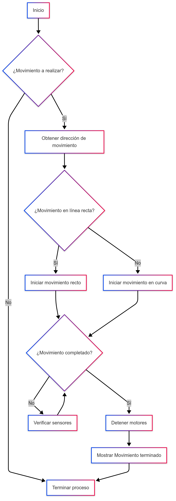

# Laboratorio1_Robotica
Desarrollo del primer laboratorio de Robótica 2025-1

Inicialmente, se deseaba controlar la tortuga con las flechas del teclado, moviéndola hacia adelante y hacia atrás con las flechas "Up" y "Down", respectivamente. Asimismo, se deseaba que la tortuga girara hacia la izquierda y hacia la derecha con las flechas "Left" y "Right", respectivamente.

Para ello, lo primero que se hizo fue crear una función que reconociera cuándo se oprimía una tecla del teclado. Esta función se nombró "listen_key" y se implementó utilizando la librería "threading". Esta función permite que, al presionar cualquier flecha del teclado, se ejecute la función correspondiente.

Después, se creó una función para cada tecla. En total, se crearon cuatro funciones llamadas "move_forward", "move_backward", "turn_left" y "turn_right". En ellas, se ejecutaron los comandos "msg.linear.x" y "msg.angular.z" con el fin de que la tortuga realizara el movimiento deseado. Por ejemplo, en la función "move_backward", se ejecuta el siguiente comando: "msg.linear.x = -1.0", con el objetivo de que la tortuga retroceda.

Con estas funciones se logró cumplir con el objetivo del primer punto del laboratorio. Con el fin de que haya una mejor comprensión del código, a continuación se muestra un diagrama de flujo que representa la solución planteada para dicho problema.

Luego se solicitó que la tortuga dibujara las letras correspondientes a las iniciales de los nombres y apellidos de los miembros del grupo. En este caso, se dibujarían las letras "S", "Z", "J", "F", "H" y "G". Para ello, nuevamente se utilizó la función creada anteriormente, "listen_key", con el fin de leer las teclas que se oprimen en el teclado. Así, por cada tecla presionada, se ejecuta una función diferente para dibujar la letra correspondiente.

Se optó por crear un contador, "count", con el fin de que la tortuga siguiera una serie de instrucciones y dibujara la letra correspondiente. Se procedió a crear una función para cada letra, llamadas "move_turtles", "move_turtlez", "move_turtlej", "move_turtlef", "move_turtleh" y "move_turtleg". Dichas funciones tienen una serie de condicionales que corresponden al orden de las instrucciones que se le otorgan a la tortuga.

Cabe aclarar que se creó un timer con el fin de que, al oprimir una letra, la función correspondiente de la letra se ejecutara cada cierto tiempo. Es aquí donde el contador resultó útil, ya que permitía generar una lista de instrucciones para dibujar la letra. Sabiendo que la función para dibujar la tortuga se repetía cada 0.5 segundos, se optó por ejecutar los comandos "msg.linear.x" y "msg.angular.z" para iniciar cada dibujo. En este punto, surgieron varios problemas, ya que, en realidad, la función no se repetía exactamente cada 0.5 segundos. Como resultado, cada vez que se ejecutaba el código, la letra se dibujaba de manera diferente y, a veces, ni siquiera era posible reconocerla.

Por tal motivo, se optó por utilizar una suscripción que permite obtener el ángulo de la tortuga en cualquier momento. Se creó una función llamada pose_callback, que asigna a la variable "current_angle" el ángulo de la tortuga. Con esta variable, fue mucho más fácil controlar la tortuga con mayor precisión, especialmente en las rotaciones, donde se presentaban más problemas. Las funciones asignadas para cada letra (donde se incluye la lista de instrucciones para dibujar la letra) fueron modificadas. Ahora, para realizar un giro, se compara el ángulo deseado con el ángulo real de la tortuga cada 0.5 segundos. Así, asignando una velocidad angular considerablemente pequeña a la tortuga, fue posible moverla con mayor precisión y dibujar las letras correctamente.

Con estas funciones y la lectura del ángulo de la tortuga, se logró cumplir con el objetivo del segundo punto del laboratorio. Con el fin de que haya una mejor comprensión del código, a continuación se muestra un diagrama de flujo que representa la solución planteada para dicho problema.

Diagramas de Flujo

Punto 1

Punto 2

Link del video
https://drive.google.com/file/d/19WCFmRM3boX6qKRJ24dMYCh4oIjYdfr1/view?usp=sharing
